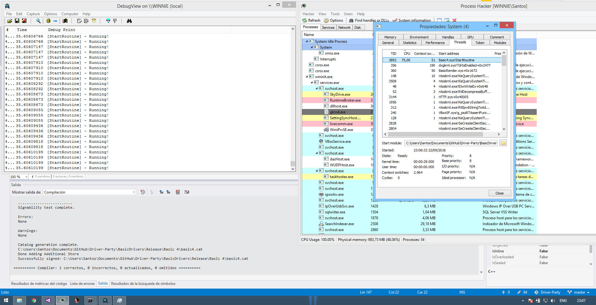
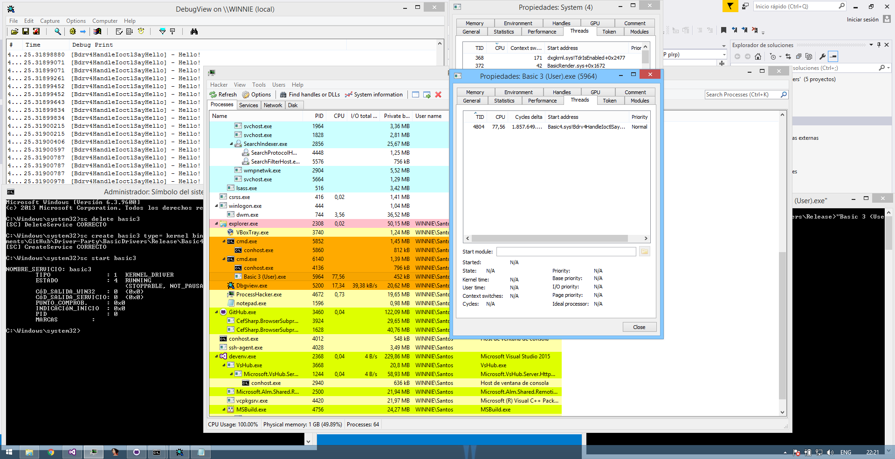

# On Exercise 1 about System Threads in Bruce's RE Book
We can confirm that calling PsCreateSystemThread with a NULL ProcessHandle, the API creates the thread in the context of System process (as expected).

Changing the fourth parameter to be a handler to the current process (i.e., the caller sending the IOCTL to the device) the thread then runs in such context (once again, as expected).

(blah, more conclusions TODO)